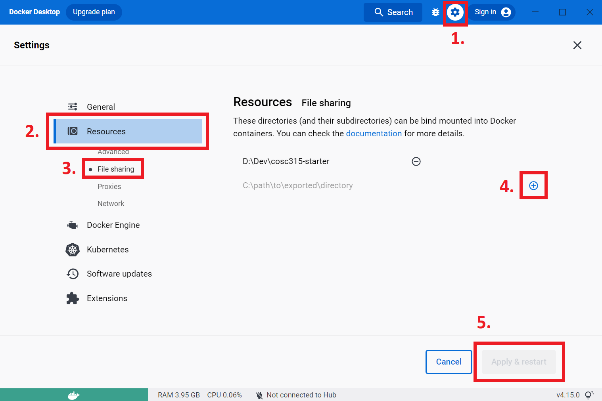

# COSC 315 Assignment Starter

Welcome to COSC 315! Before you start in on your assignments, try running through the following to ensure you have a working environment to build off of.

## Requirements

- [Docker](https://www.docker.com/products/docker-desktop/)

## Getting Started

1. Using your a terminal opened at this starter project's root directory, start the Docker container.

    ```bash
    docker compose up -d
    # If the above throws an error, try: docker-compose up
    ```

2. After the above process completes, double check the name of your container by running the following:

    ```bash
    docker ps
    # The output will look something like this:
    CONTAINER ID   IMAGE             COMMAND                  CREATED          STATUS         PORTS     NAMES
    eb647d15a206   starter-cosc315   "/bin/sh -c 'while :…"   10 seconds ago   Up 2 seconds             cosc315
    # Your container should have the name "cosc315"
    ```

3. Attach an interactive shell to your container with the following command:

    ```bash
    docker exec -it cosc315 /bin/bash
    ```

    If you're on **Windows**, you may need to run the following command instead:

    ```bash
    docker exec -it cosc315 //bin//bash
    ```

    If successful, your terminal should display something along the lines of `root@...`

4. Change your directory to the development folder mounted in the container:

    ```bash
    cd /cosc315
    ls
    # You should see something like the following
    > Dockerfile  README.md  docker-compose.yml  test.c
    ```

5. Compile and run `test.c` with the following:

    ```bash
    gcc test.c -o test.out && ./test.out
    # You should see something like the following
    > Hello C Programming!
    ```

## Troubleshooting

### Error Response from Daemon: user declined directory sharing...

If you encounter this error when using docker compose to boot your container on **Windows**, you need to manually add your starter code project directory to Docker for sharing.

To do this, open the docker dashboard (usually openable by double clicking the system tray icon in the bottom right corner), click the settings button, click Resources -> File Sharing, and then add your directory by clicking the blue plus button. After adding your directory, click "Apply & Restart".

These steps are illustrated below:


